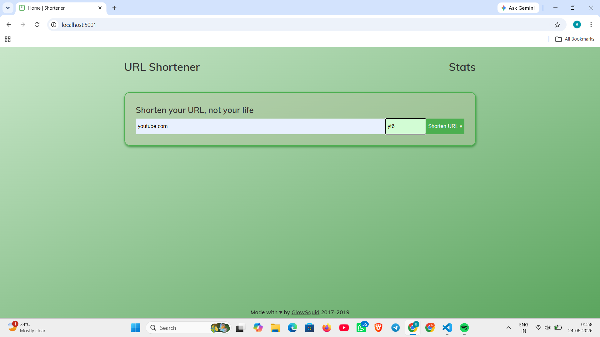
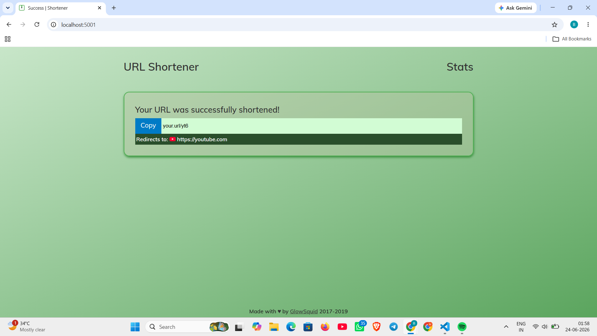
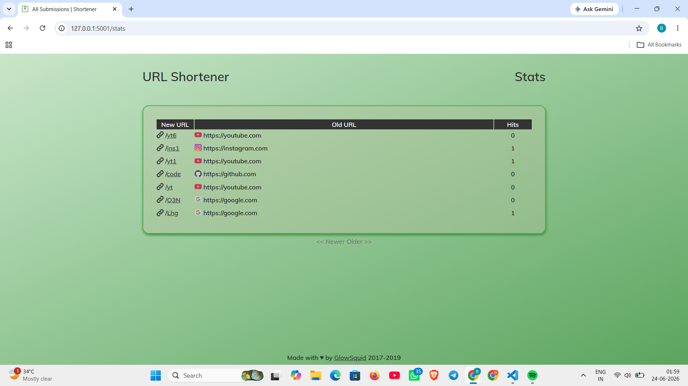

# Flask URL-Shortener

A simple web application to shorten long URLs into shorter, shareable links.

## Features

- Generate short URLs for long links
- Support custom aliases
- Redirect shortened links to original URLs
- Store URLs in SQLite database
- Track number of clicks on each shortened URL

## Screenshots

### Home Page

### Success Page

### Stats Page

## Tech Stack

- Python
- Flask
- SQLAlchemy
- SQLite
- HTML/CSS

## How to Run
1. Clone the repository
2. Create a virtual environment
3. Install dependencies:
   pip install -r requirements.txt
4. Run:
   python main.py

## Example
Original:
https://youtube.com

Shortened:
http://localhost:5001/yt1
